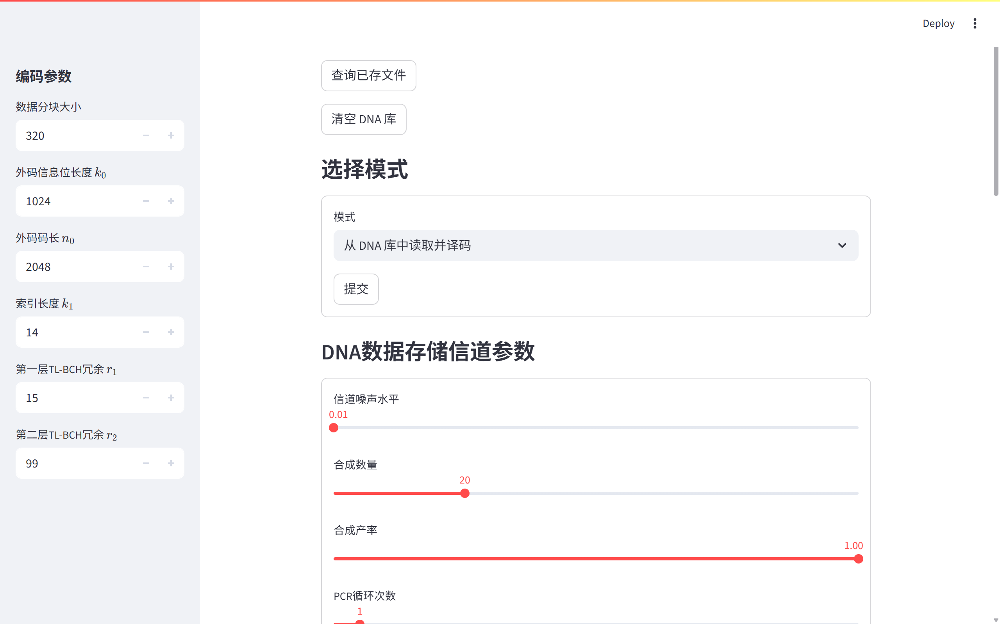
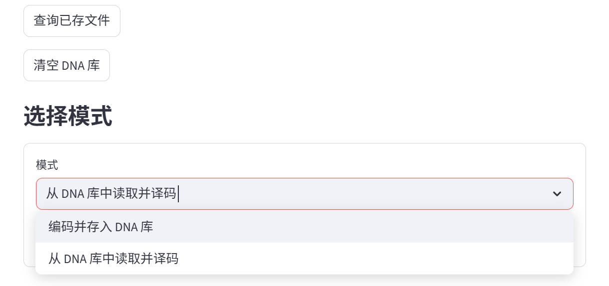
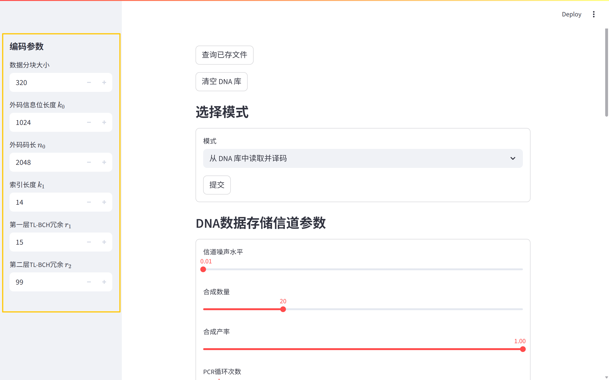
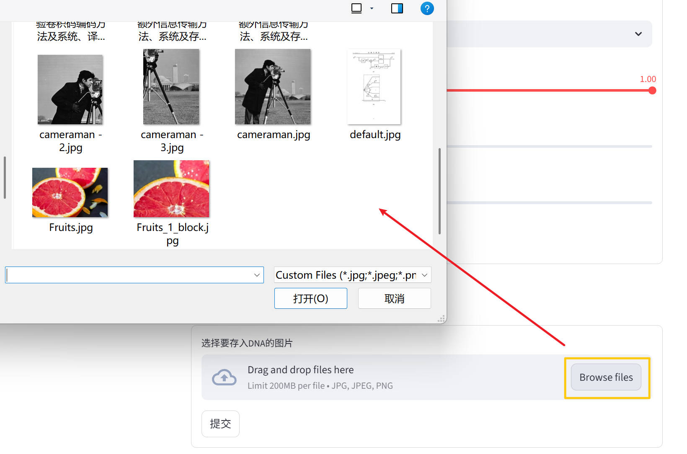
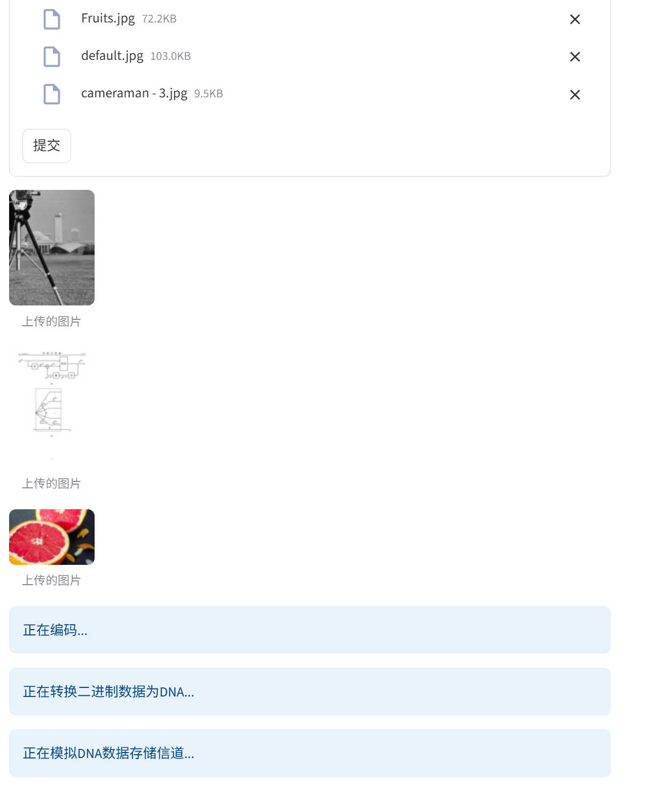
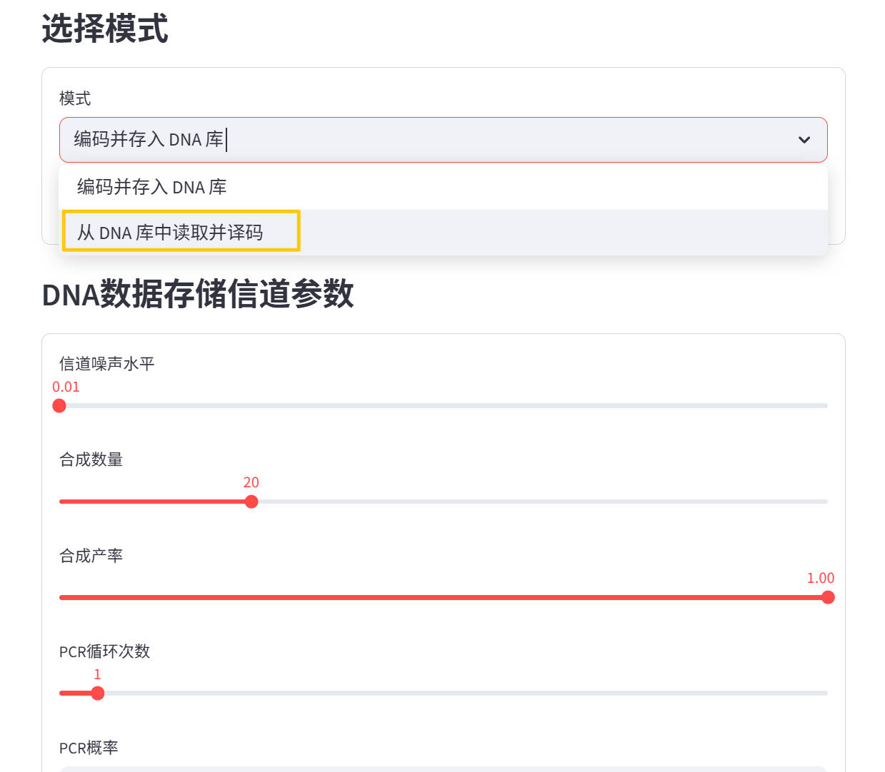
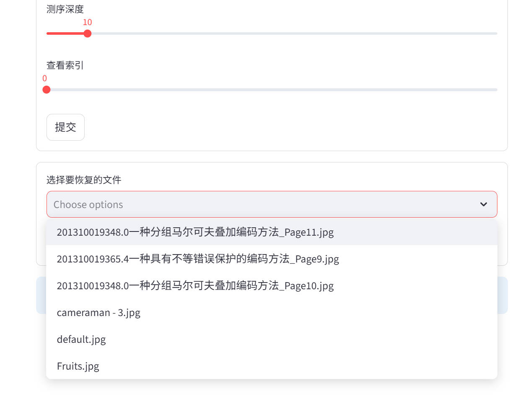
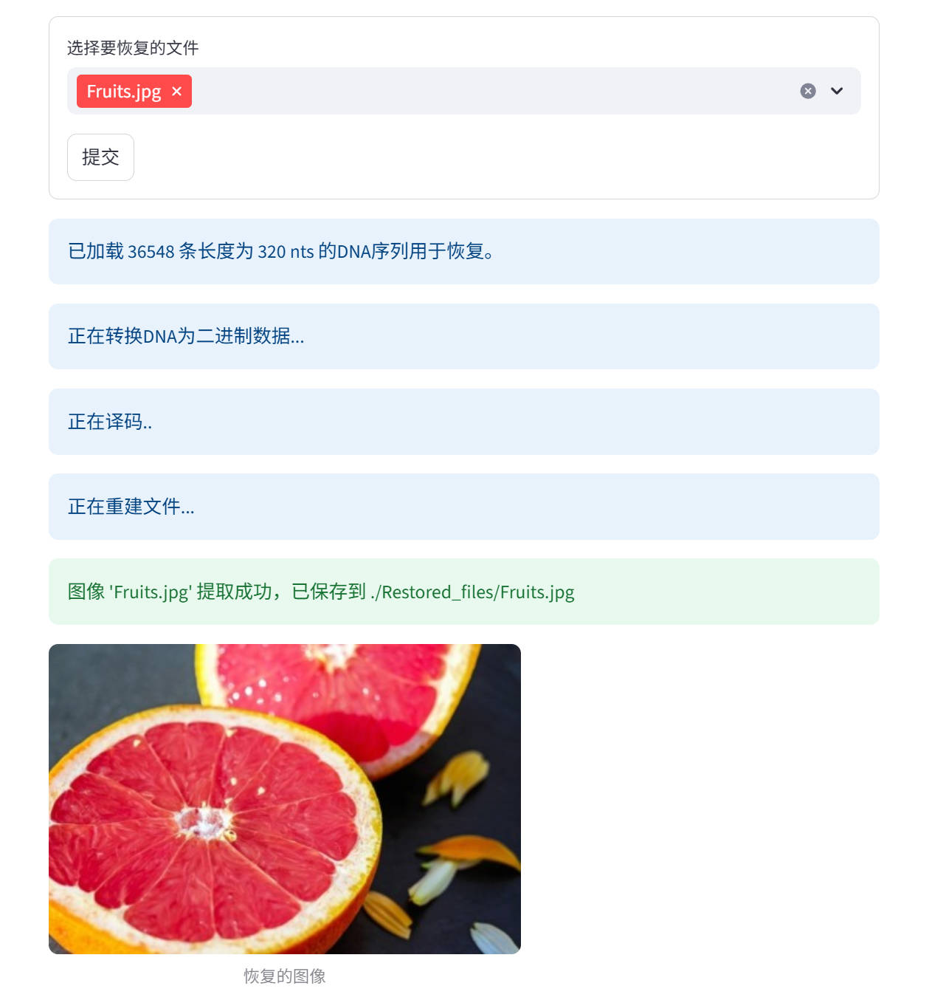

# COPDS：DNA 存储仿真平台

COPDS(Code Optimization Platform for DNA Storage) 是一个基于 Streamlit 的 DNA 数据存储仿真演示平台，提供从图像编码为 DNA 链、模拟 DNA 存储/测序信道效应，到解码并重建原始图像的端到端流程。本项目面向科研演示与可复现实验。



## 亮点

- 图像到 DNA、DNA 到图像的端到端流程
- 外层 16 进制 LDPC + 内层 BCH 编码链路
- DNA 信道仿真（合成、衰变、PCR、测序）
- 可复现的中间产物，便于分析
- Streamlit UI，快速实验与展示

## 快速开始（Windows）

### 1) 环境要求

- Windows 64 位
- Python 3.12.x 64 位（从 python.org 安装，勾选 "Add Python to PATH"）
- Microsoft C++ Build Tools（MSVC v143，用于编译 pybind11 扩展）

### 2) 创建并激活虚拟环境

```powershell
python -m venv .venv
.\.venv\Scripts\Activate.ps1
```

### 3) 安装依赖

```powershell
python -m pip install --upgrade pip
python -m pip install -r requirements.txt
```

### 4) 构建 FFTQSPA 扩展

```powershell
Set-Location Encode\Nonbinary
python setup.py build_ext --inplace
```

确认输出文件存在：

- `Encode/Nonbinary/fftqspa.cp312-win_amd64.pyd`

### 5) 运行应用

```powershell
Set-Location ../..
streamlit run Webapp.py
```

在终端输出的 URL（通常为 http://localhost:8501）打开应用。

## 使用指南

### 编码并存储到 DNA

1. 在模式选择一栏选择 **编码并存储DNA库**，点击 **提交**。

---
2. 调整 DNA 信道参数，以模拟不同存储条件。

---
3. 选择编码参数（当前固定为默认值）。

---
4. 上传一张或多张图片（`jpg`、`jpeg`、`png`），点击 **提交** 开始编码并写入 DNA 库。

---
5. 系统生成 DNA 池并输出仿真结果。


**输出内容**：
- 输入 DNA 池：`DNA_Library/{file_id}_in.dna`
- 仿真 DNA 池：`DNA_Library/{file_id}_out.dna`
- 中间文件：`Mid_data/`
- 元数据：`config/config.json`

### 从 DNA 库中读取文件并译码

1. 在侧边栏选择 **从 DNA库中读取并译码**，点击 **提交**。

2. 从列表中选择想要读取的文件，然后点击 **提交**。将从 DNA 库中读取数据、解码，并尝试还原成图像。

3. 还原后的图片写入 `Restored_files/`。


## 项目结构

- `Webapp.py`：Streamlit 入口与流程编排
- `Helper_Functions.py`：分块、DNA/二进制转换、BCH/LDPC 封装
- `Encode/Nonbinary/`：FFTQSPA 编解码源代码与编译扩展
- `Model/Model.py`：DNA 信道仿真
- `config/config.json`：持久化元数据
- `DNA_Library/`：DNA 池
- `Mid_data/`：中间文件
- `Restored_files/`：还原输出
- `Analysis/e2e_run_default_jpg.py`：端到端验证脚本

## 备注

- 本项目为研究演示用途。
- 历史版本生成的部分 DNA 池与当前正确解码流程不兼容，需重新编码。
- 若 `fftqspa` 导入失败，请在激活 venv 后于 `Encode/Nonbinary/` 下重新构建扩展。
